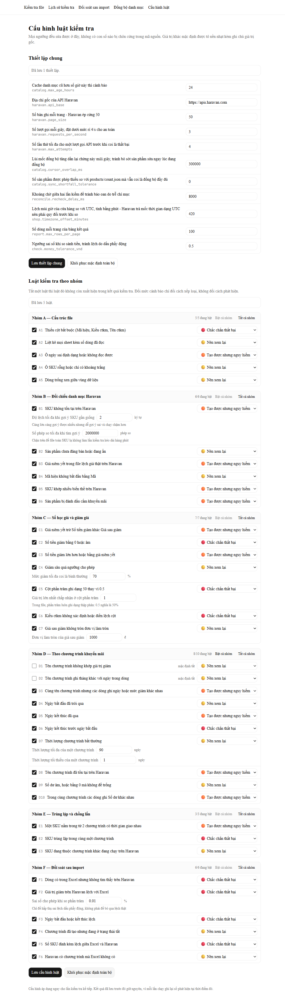

# Hướng dẫn sử dụng

Dành cho người phụ trách nhập khuyến mãi. Không cần biết lập trình.

Công cụ trả lời hai câu hỏi:

1. **Trước khi import** — file Excel này có chỗ nào sai không?
2. **Sau khi import** — Haravan đã nhận đúng như file chưa?

Công cụ **chỉ đọc** dữ liệu Haravan, không bao giờ ghi. Chạy nó không làm thay đổi bất cứ chương trình khuyến mãi nào.

## Trước khi bắt đầu

Công cụ so mã hiệu (SKU) trong file với danh sách sản phẩm lấy từ Haravan về. Danh sách đó nằm trong bộ nhớ đệm, cần được làm mới định kỳ.

Vào **Đồng bộ danh mục**, xem dòng "Đồng bộ đầy đủ gần nhất":

- Nếu có cảnh báo đỏ báo cache đã cũ hoặc chưa đồng bộ lần nào → bấm **Đồng bộ lại từ đầu**, chờ vài chục giây rồi hãy kiểm tra file.
- Nếu không có cảnh báo → làm tiếp bình thường.

Bỏ qua bước này thì toàn bộ luật nhóm B bị bỏ qua, và công cụ sẽ nói rõ là đã bỏ qua chứ không im lặng báo file sạch.

## Bước 1 — Kiểm tra file trước khi import

Vào **Kiểm tra file**, kéo file `.xlsx` thả vào khung, hoặc bấm để chọn file.

Chờ vài giây, màn hình kết quả hiện ra:

- **Ba ô đếm ở đầu trang** — số phát hiện theo ba mức.
- **Bảng chương trình** — mỗi chương trình một dòng, kèm số dòng và số phát hiện. Chương trình nào nhiều lỗi nhất nằm trên cùng.
- **Bảng phát hiện** — từng lỗi một, có số dòng Excel thật để mở file ra sửa.

### Ba mức cảnh báo nghĩa là gì

| Mức | Nghĩa | Nên làm gì |
|---|---|---|
| 🔴 Chắc chắn thất bại | Haravan sẽ từ chối, chương trình không được tạo | Phải sửa trước khi import |
| 🟠 Tạo được nhưng nguy hiểm | Haravan nhận, nhưng kết quả kinh doanh sai hoặc tốn tiền | Xem kỹ từng dòng |
| 🟡 Nên xem lại | Có thể là cố ý | Liếc qua cho chắc |

Công cụ **chỉ cảnh báo, không chặn**. Quyết định import hay không là của người dùng.

### Lọc cho dễ nhìn

Bảng phát hiện lọc được theo mức cảnh báo, theo mã luật, và theo tên chương trình. Việc lọc chạy ở máy chủ nên file mấy nghìn dòng vẫn nhanh.

### Tải báo cáo về

Nút **Tải báo cáo Excel** ở đầu trang kết quả xuất ra chính file gốc, tô màu những ô có vấn đề và thêm một sheet tổng hợp. Tiện để gửi cho người khác sửa.

File 3.900 dòng mất khoảng 6 giây để dựng, cứ chờ.

## Bước 2 — Đối soát sau khi import

Import file lên Haravan bằng công cụ import quen dùng, rồi quay lại đây.

Vào **Đối soát sau import**, chọn lần kiểm tra trước đó trong danh sách, hoặc tải lại chính file vừa import lên.

**Vừa import xong nên chờ ít phút.** Danh sách chương trình của Haravan cập nhật chậm vài giây. Công cụ đã tự kiểm hai lượt cách nhau một khoảng ngắn để tránh báo oan, nhưng import xong đối soát liền vẫn dễ ra kết quả sai.

Kết quả là bảng so ba cột: **file ghi gì — Haravan có gì — lệch chỗ nào**. Trạng thái mỗi chương trình:

| Trạng thái | Nghĩa |
|---|---|
| Khớp | Tìm thấy trên Haravan, đang so từng trường |
| Không tìm thấy | File có, Haravan không có — nhiều khả năng import sót |
| Trùng tên | Haravan có nhiều chương trình cùng tên nên công cụ không dám tự chọn cái nào |
| Chỉ có trên Haravan | Haravan có mà file không có |

## Bước 3 — Chỉnh cấu hình khi cần

Vào **Cấu hình luật**. Mọi ngưỡng của công cụ đều sửa được ở đây, không có con số nào bị chôn cứng trong mã nguồn.

### Thiết lập chung

Phần trên cùng là các thiết lập dùng chung, ví dụ bao lâu thì coi cache danh mục là cũ, hay chờ bao lâu giữa hai lượt đối soát. Mỗi dòng ghi rõ tên kỹ thuật của thiết lập ngay dưới phần mô tả.

### Luật kiểm tra

37 luật chia sáu nhóm A–F. Mỗi dòng có:

- **Ô tích** — bật hoặc tắt luật đó. Tắt thì luật không còn xuất hiện trong kết quả.
- **Ô chọn mức** — đổi luật đó thành 🔴 / 🟠 / 🟡. Chỉ đổi cách xếp loại, không đổi cách phát hiện.
- **Ô nhập ngưỡng** — chỉ có ở vài luật, ví dụ luật C4 cho đặt mức giảm tối đa coi là bình thường.

Ở đầu mỗi nhóm có nút **Bật cả nhóm** / **Tắt cả nhóm** cho trường hợp cả nhóm không còn phù hợp với quy trình.

Hai luật **D1** và **D2** mặc định tắt, vì quy tắc đặt tên chương trình không phải quy định bắt buộc. Ai muốn áp quy ước riêng thì bật lên.

### Giá trị nào đang khác mặc định

Dòng nào khác mặc định thì có nền nhạt, có ghi chú giá trị gốc, và có nút **Về mặc định** ngay bên cạnh. Nút **Khôi phục mặc định toàn bộ** ở cuối mỗi phần trả tất cả về như lúc mới cài.

### Nhập sai thì sao

Nhập giá trị ngoài khoảng cho phép, ví dụ đặt mức giảm tối đa là 500%, công cụ sẽ **không lưu** và báo ngay dưới ô nhập bằng tiếng Việt. Giá trị vừa gõ được giữ nguyên trên màn hình để sửa lại, không bị mất.

### Đổi cấu hình có làm hỏng kết quả cũ không

Không. Mỗi lần chạy đã ghi lại số phát hiện tại thời điểm đó, mở lại vẫn thấy nguyên. Cấu hình mới chỉ áp dụng cho lần kiểm tra kế tiếp.

## Xem lại việc đã làm

**Lịch sử kiểm tra** liệt kê 100 lần chạy gần nhất, mở lại được bất cứ lúc nào. Lần đối soát cũng lưu lại tương tự, xem ở cuối màn **Đối soát sau import**.

## Gặp trục trặc

| Hiện tượng | Nguyên nhân thường gặp |
|---|---|
| Báo "Chưa đồng bộ danh mục sản phẩm" | Cache trống — chạy đồng bộ rồi kiểm tra lại |
| Rất nhiều SKU báo không tồn tại | Cache đã cũ, hoặc đồng bộ nhầm cửa hàng |
| Đối soát báo không tìm thấy hàng loạt | Đối soát quá sớm sau khi import — chờ vài phút rồi chạy lại |
| Không tải được file lên | File không phải `.xlsx`/`.xls`, hoặc vượt dung lượng cho phép |

Trục trặc không nằm trong bảng trên thì báo người phụ trách kỹ thuật, kèm thời điểm và tên file.
